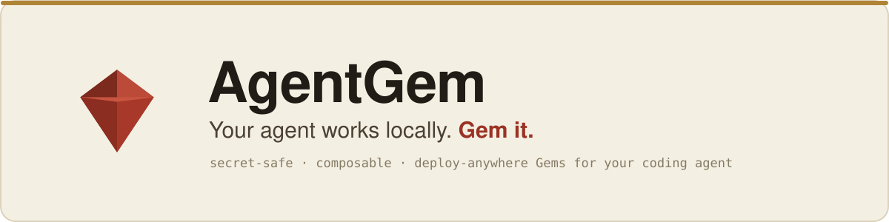
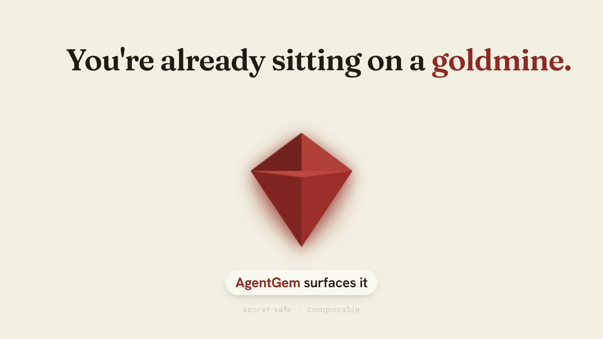
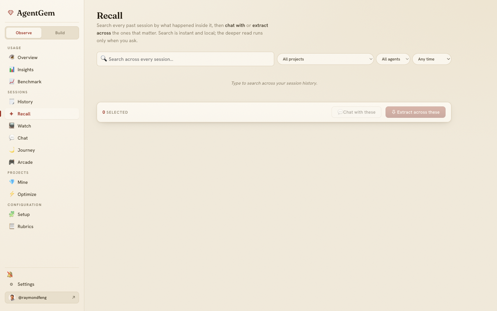
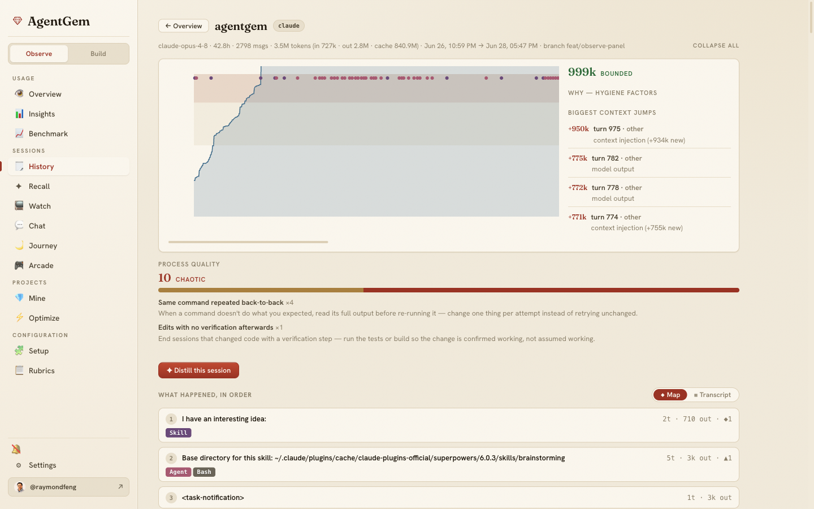
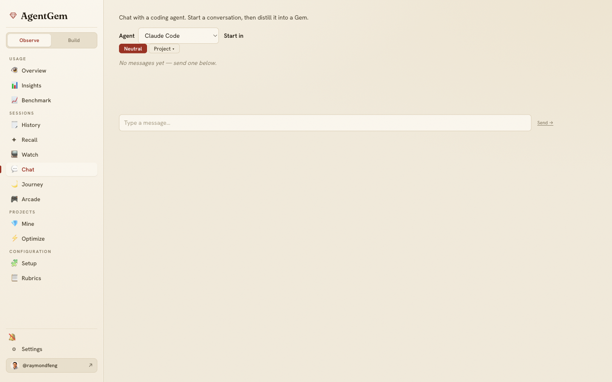
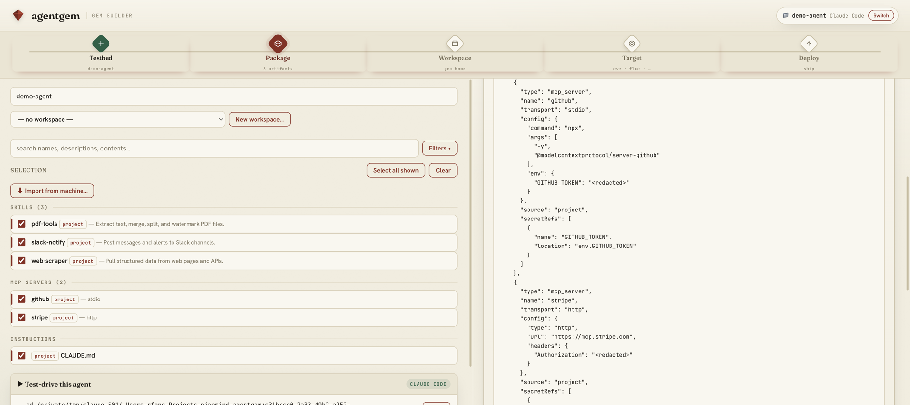

<p align="center">
  <a href="https://agentgem.ninemind.ai"></a>
</p>

<p align="center">
  <a href="https://www.npmjs.com/package/@ninemind/agentgem"></a>
  <a href="https://github.com/ninemindai/agentgem/actions/workflows/ci.yml"></a>
  <a href="LICENSE"></a>
  <a href="https://nodejs.org"></a>
  <a href="https://agentback.dev"></a>
  <a href="docs/concepts.md"></a>
</p>

<p align="center">
  <a href="https://agentgem.ninemind.ai/assets/agentgem-reel.mp4" title="Watch the 60-second AgentGem reel">
    
  </a>
  <br>
  <a href="https://agentgem.ninemind.ai/assets/agentgem-reel.mp4"><b>▶&nbsp; Watch the 60-second reel</b></a>
</p>

> A local web UI that introspects your coding-agent config, redacts secrets at
> capture, and builds a portable, composable **Gem**.
>
> **[agentgem.ninemind.ai](https://agentgem.ninemind.ai)** ·
> browse the public marketplace at **[app.agentgem.ai](https://app.agentgem.ai)**
> *(early testbed — hosted data may be reset)*

AgentGem reads your coding-agent config — skills, MCP servers, and `CLAUDE.md` —
**redacts secrets the moment they're read**, and produces a **Gem**: a manifest + lock
archive you can publish to a GitHub-backed registry, merge with other Gems, and deploy to
several targets. A browser can't read `~/.claude` (it's sandboxed), so AgentGem runs a
small server on your machine; secrets never leave your device — what crosses any boundary
is a config *shape* with `<redacted>` in place of every sensitive value.

Built on [AgentBack](https://www.npmjs.com/org/agentback), ninemind's AI-native API/MCP
framework: every operation is defined once as a Zod contract and exposed as a REST
endpoint, an MCP tool, and an OpenAPI 3.1 document — so the web page and your local agent
call exactly the same thing.

## What it provides

- **Secret-safe capture** — redaction by value and by key name, before anything reaches a
  REST response, an MCP result, the live preview, or the built Gem.
- **A neutral Gem source** — a manifest + lock archive that isn't tied to any runtime.
  Build once; install into a local testbed, merge, publish, or compile to a target without
  re-reading raw config.
- **Composition** — the manifest/lock split lets small, focused Gems be reconciled into
  larger agents with a single re-resolved lock, not a pile of overlapping config.
- **Workflow-aware recommendations** — [Analyze](docs/analyze.md) scans your agent's
  session history to see which skills, MCP servers, and hooks you actually use, and
  suggests ready-to-build Gems grouped by recurring workflow. It also **distills brand-new
  draft skills** from the procedures you repeat by hand — review them and fold them
  straight into a Gem.
- **Cross-session recall** — [Recall](docs/recall.md) searches across every past session
  by what happened inside it (an instant, local, secret-scrubbed index), then lets you
  chat with or extract across the ones that matter. The same intelligence is the
  **`agentgem-goldmine`** MCP server, so any coding agent can query your history.
- **Context-hygiene detection** — [context hygiene](docs/context-hygiene.md) grades each
  session for context bloat with LLM-free detectors, marks a deterministic "cut here at
  turn N", and — via `agentgem warm --watch --nudge` — raises a live OS notification when
  a running session's context gets heavy.
- **Chat, and Play** — [Chat](docs/chat.md) with a local coding agent from inside the
  console and distill the conversation into a Gem; [Play](docs/play.md) builds
  AI-generated mini-games, sealed to run anywhere and versioned as first-class `game` Gems.
- **Deploy targets** — Eve and OpenAI Sandbox (code-gen), Flue (materialize, deployable to
  Cloudflare), and Bedrock AgentCore (managed backend); code-gen targets share a common
  `compose` step.
- **Agent-to-agent (A2A)** — export a Gem as an [A2A](docs/a2a.md) Agent Card or a
  runnable A2A server so other agents can discover and call it.
- **A native desktop app** — a [macOS/Windows/Linux build](docs/desktop.md) alongside the
  `npx` CLI, hosting the same local server in its own window.
- **A GitHub-backed registry + public marketplace** — publish, resolve, merge, and
  install composable Gems over the same archive format, and browse published Gems and
  curated skills at [app.agentgem.ai](https://app.agentgem.ai) — star, review, preview,
  and copy an install command. The hosted marketplace is an **early testbed**: treat it
  as a preview, and expect accounts, stars, and reviews to be reset occasionally.
- **Registry-free sharing & identity** — [`agentgem get`](docs/sharing.md) installs a
  published Gem with one command; `agentgem send` / `receive` pass one directly over an
  encrypted, one-time hand-off; `agentgem bind` ties a GitHub identity to this machine's
  signing key; `agentgem verify` checks a Gem runs across your local agents.
- **An agent-native path** — every operation is also an MCP tool, so your local agent can
  build Gems over `/mcp` with no browser involved.

## A tour of the console

<table>
  <tr>
    <td width="50%">
      
      <p align="center"><b>Recall</b> — search across every past session by what happened inside it, then chat with or extract across the ones that matter. <a href="docs/recall.md">↗</a></p>
    </td>
    <td width="50%">
      
      <p align="center"><b>Context hygiene</b> — a per-session bloat timeline, the biggest context jumps, and a deterministic "cut here at turn N". <a href="docs/context-hygiene.md">↗</a></p>
    </td>
  </tr>
  <tr>
    <td width="50%">
      
      <p align="center"><b>Play</b> — AI-generated mini-games, built by chatting and sealed to run anywhere, each a first-class <code>game</code> Gem. <a href="docs/play.md">↗</a></p>
    </td>
    <td width="50%">
      
      <p align="center"><b>Chat</b> — drive a local coding agent grounded in your transcripts, then distill the conversation into a Gem. <a href="docs/chat.md">↗</a></p>
    </td>
  </tr>
</table>

## Quickstart

Needs Node.js ≥ 24. From the directory of the agent project you want to package,
run it without installing:

```bash
npx @ninemind/agentgem         # npm
pnpm dlx @ninemind/agentgem    # pnpm
```

```text
agentgem listening at http://127.0.0.1:4317
  UI:       http://127.0.0.1:4317/
  API:      http://127.0.0.1:4317/api/inventory  ·  POST http://127.0.0.1:4317/api/gem
  Explorer: http://127.0.0.1:4317/explorer/
  MCP:      http://127.0.0.1:4317/mcp
```

Open **<http://127.0.0.1:4317/>**, then:

1. **Open a testbed** — click *Create / open testbed…*. AgentGem detects the project
   you launched from (it has a `.claude`/`.codex`) and also lists ones from your
   Claude/Codex session history. Pick it and click *Use this*.
2. **Pick artifacts** — the project's skills / MCP servers / `CLAUDE.md` show on the
   left; *Import from machine…* pulls in global ones. Tick what you want, name the Gem.
3. **Watch it seal** — the live `gem.json` renders with every secret as `<redacted>`.
   Download it — that archive is what every target and the registry consume.

<p align="center">
  " width="100%">
</p>

Prefer a persistent command? Install it globally:

```bash
npm install -g @ninemind/agentgem     # npm
pnpm add -g @ninemind/agentgem        # pnpm
agentgem --port 8080                  # honors $PORT; append ?dir=/path/to/.claude for another config
```

| Path        | What it is                                              |
| ----------- | ------------------------------------------------------- |
| `/`         | The Gem Builder web UI                                  |
| `/explorer` | Swagger UI for the REST API (from the OpenAPI document) |
| `/mcp`      | The MCP endpoint — the same contract, for your agent    |

### From source

To hack on AgentGem, clone the repo. It's a [pnpm](https://pnpm.io/) project
(`npm` works too), and AgentBack uses legacy decorators, so it builds with `tsc`
then runs `dist/`:

```bash
pnpm install     # or: npm install
pnpm dev         # or: npm run dev   — build + start in one step
pnpm test        # or: npm test      — tsc -b && vitest run, against compiled dist/
pnpm clean       # or: npm run clean — rm -rf dist *.tsbuildinfo (run before re-testing after moves)
```

See [CONTRIBUTING.md](CONTRIBUTING.md) for the full workflow.

### Desktop app

Prefer a double-click app over the CLI? AgentGem ships a native **desktop build**
for macOS, Windows, and Linux — download it from
[Releases](https://github.com/ninemindai/agentgem/releases) (a `desktop-v*` build).
It hosts the same local server in its own window, adds a native folder picker, app
menu, and system tray, and never sends secrets off your machine.

> The builds are currently **unsigned**: on macOS right-click → **Open**, on Windows
> choose **More info → Run anyway** the first time.

To run or package it from source, see the [desktop guide](docs/desktop.md) — in
short, `pnpm -C desktop dev` to run, `pnpm -C desktop dist` to build installers.

## Layering

Depends on AgentBack: `@agentback/core` (lifecycle), `@agentback/rest` +
`@agentback/rest-explorer` (HTTP + Swagger UI), `@agentback/mcp` + `@agentback/mcp-http`
(MCP over HTTP), and `@agentback/openapi` (the OpenAPI 3.1 document). The web UI, the REST
API, and the MCP endpoint are three boundaries over one set of Zod contracts —
`src/index.ts` wires them onto a single `RestApplication`.

For deeper reference, see [`docs/`](docs/index.md):
[getting started](docs/getting-started.md) ·
[desktop app](docs/desktop.md) ·
[analyze](docs/analyze.md) ·
[concepts](docs/concepts.md) ·
[targets & deploy](docs/targets.md) ·
[GitHub App](docs/deploy/github-app.md) ·
[A2A](docs/a2a.md) ·
[registry](docs/registry.md).

## License

[MIT](LICENSE) © ninemind.ai
