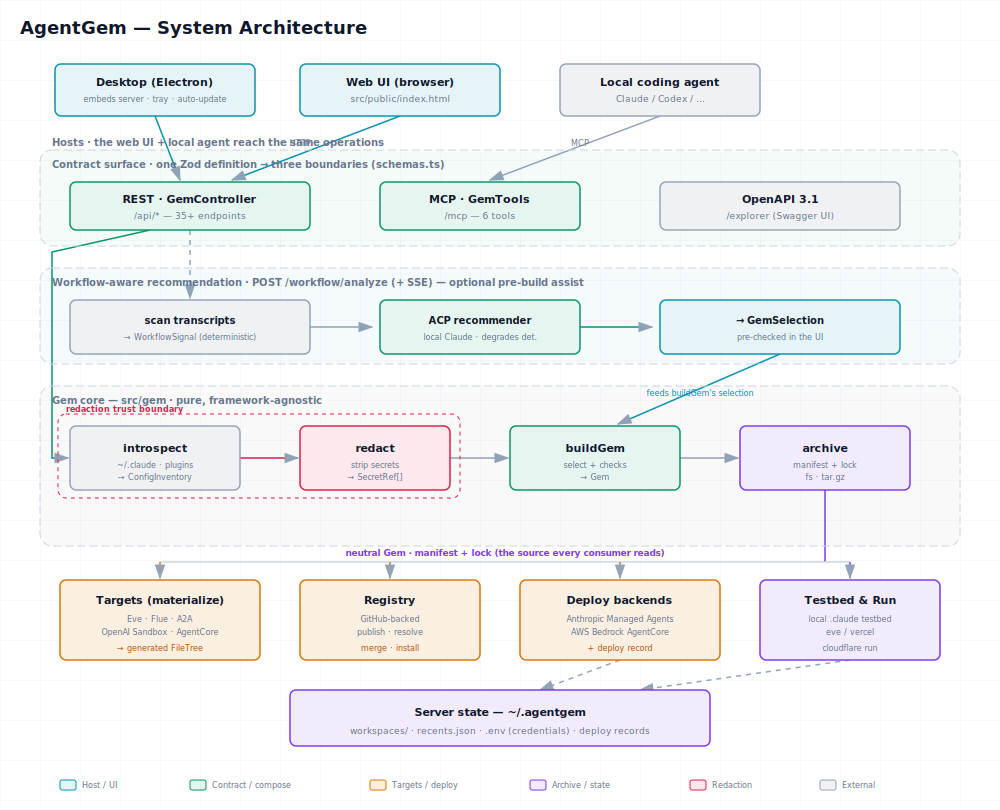
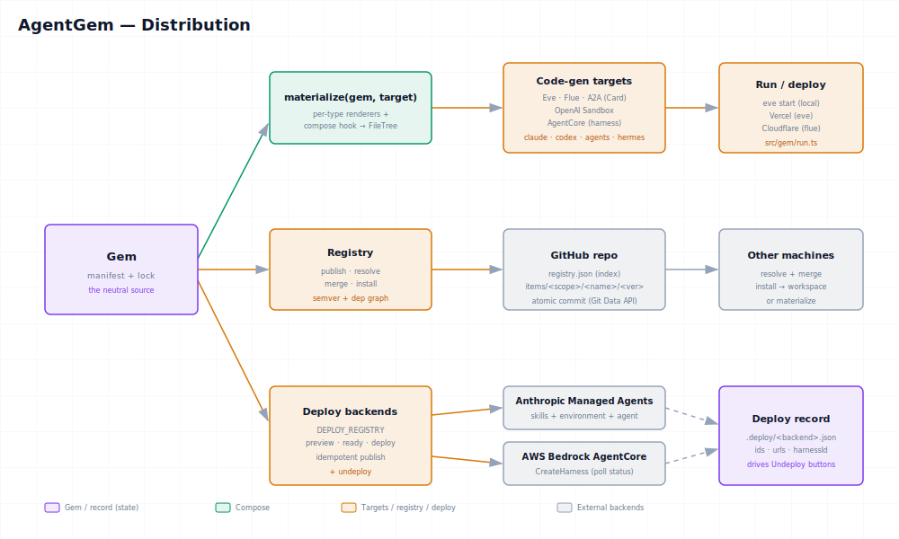

# Architecture

This page is the technical map of AgentGem: how a request flows from a client, through
the contract surface, into the framework-agnostic Gem core, and out to archives, targets,
the registry, and deploy backends. For the conceptual "why," read [Concepts](concepts.md)
first.

## The big picture



> Diagram: [`diagrams/system-architecture.svg`](diagrams/system-architecture.svg) ·
> [PNG](diagrams/system-architecture.png) ·
> [interactive HTML](diagrams/system-architecture.html) (Copy / PNG / PDF export)

There are four horizontal bands:

1. **Hosts / clients** — the web UI (`src/public/index.html`), any local coding agent, and
   the [Desktop app](desktop.md), which embeds the same server in Electron (tray + auto-update).
2. **Contract surface** — one Zod definition per operation, surfaced as a REST endpoint, an
   MCP tool, and an OpenAPI 3.1 document. See [the one-contract model](#the-one-contract-model).
3. **Gem core** (the `@agentgem/*` packages) — pure, framework-agnostic functions:
   `introspect` → `redact` → `buildGem` → `archive`. See the [build pipeline](pipeline.md).
4. **Distribution** — the neutral Gem feeds targets (materialize), the registry, deploy
   backends, and local testbeds/runs. See [distribution](#distribution) below.

An optional **workflow-aware recommendation** path sits in front of the core: `POST
/workflow/analyze` (plus an SSE progress stream) scans a project's Claude transcripts into a
deterministic `WorkflowSignal`, then runs two local ACP agents **concurrently** — one clusters
and names candidate Gems (degrading to a frequency ranking if the agent is unavailable), the
other **distills new draft skills** from the recurring builtin procedure the scan would otherwise
discard. It emits a `WorkflowAnalysis` of pre-checked `GemCandidate[]` plus `DistilledSkill[]`
drafts; both feed `buildGem` (an accepted draft is staged into the inventory by name). The
recommender only ranks what introspection already found; distillation is the deliberate exception
— brand-new drafts behind a human-review gate. See [Analyze](analyze.md).

Server-side state lives under `~/.agentgem` (workspaces, recents, credentials, deploy
records) — never inside a Gem.

## The one-contract model

AgentGem is built on **AgentBack**. The entry point `src/index.ts` wires a single
`RestApplication` with both an HTTP server and an MCP server:

```ts
const app = new RestApplication({});
app.configure("servers.RestServer").to({ port, host: "127.0.0.1" });
app.component(MCPComponent);
app.configure("servers.MCPServer").to({ name: "agentgem", version: "0.1.0", transports: { stdio: false } });
app.restController(GemController);   // REST  → /api/*
app.service(GemTools);              // MCP   → /mcp
await installExplorer(app, { title: "agentgem API" }); // OpenAPI + Swagger → /explorer
await installMcpHttp(app);
```

| Boundary | Surfaced by | Path | Notes |
| --- | --- | --- | --- |
| REST | `GemController` (`@api`) | `/api/*` | 35+ endpoints; the stateful surface (workspaces, deploy, publish) |
| MCP | `GemTools` (`@mcpServer`) | `/mcp` | 6 tools; read + plan operations for agents |
| OpenAPI / Swagger | `installExplorer` | `/explorer` | Derived from the same Zod schemas |
| Web UI | Express route | `/` | Serves the single-page builder |

REST and MCP are **not** parallel re-implementations: both call the same helper functions
(e.g. `introspectAll`, `buildGem`) and validate against the same schemas in
`src/schemas.ts`. The REST surface simply adds the stateful operations (workspace CRUD,
run, deploy, publish) that a UI needs; MCP focuses on the read-and-plan operations an agent
needs. See the full list in the [API reference](api-reference.md).

Because every operation is decorator-defined, the build **must** compile with
`experimentalDecorators` + `emitDecoratorMetadata` — see [Development](development.md).

## The Gem core (`@agentgem/*` packages)

The kernel is decomposed into 12 acyclic `@agentgem/*` workspace packages (pnpm workspaces +
TypeScript project references); the server layer in `src/` stays thin and consumes them via
`@agentgem/*`. They are framework-agnostic — no HTTP, no decorators, just functions over plain
data — which is what lets the same code back a web request, an MCP tool call, and a test. The
pipeline is in [The build pipeline](pipeline.md); the on-disk result in
[Archive format](archive-format.md); the trust boundary in [Redaction](redaction.md); the full
dependency graph + rationale in [the decomposition proposal](proposals/backend-decomposition.md).

| Package | Responsibility |
| --- | --- |
| `@agentgem/model` | Core types (`Gem`, `GemArtifact`, `ConfigInventory`, `GemCheck`, …), channels, canonicalize, target specs, MCP proxy, identity, config-dir resolution |
| `@agentgem/capture` | `introspect` `~/.claude`/plugins/`~/.agents`/`~/.codex`/`~/.hermes` + project dirs → `ConfigInventory`; credentials, recents, usage, draft staging |
| `@agentgem/base` | Cross-cutting helpers: redaction (`redact`, secret patterns, leak canary), workspaces, deploy records, ACP session |
| `@agentgem/build` | `buildGem` — select artifacts by name → a `Gem` (+ checks, `requiredSecrets`); behavioral + external (`skillspector`) check scaffolding |
| `@agentgem/archive` | Lay a Gem out as `gem.json` (manifest) + `gem.lock` and verify integrity; serialize to a directory or a deterministic `.tar.gz` |
| `@agentgem/insight` | Analyze: transcript scan → `WorkflowSignal`, default-deny `scrub`, distill draft skills, ACP recommender, attestation + ingest |
| `@agentgem/distribute` | Registry (GitHub-backed index + per-version archives), share/search, SSRF-guarded fetch |
| `@agentgem/run` | Run/verify a Gem; local OS sandbox + ACP run; deploy a materialized project to Vercel/Cloudflare |
| `@agentgem/testbed` | Install a Gem into a local `.claude`/`.codex`/`.hermes` testbed; flavor detection |
| `@agentgem/deploy` | Deploy backends — Anthropic Managed Agents + AWS Bedrock AgentCore — each with an undeploy record |
| `@agentgem/aggregator` | Hosted data-moat: Postgres/pglite schema, k-anon aggregates, ingest, detection, API keys |
| `@agentgem/transfer` | NATS store-and-forward Gem transfer: seal, ticket, mint, object store |

The conceptual pipeline `introspect → redact → buildGem → archive` therefore spans
`capture → base → build → archive`; the optional **Analyze / workflow-aware** path
(scan → distill drafts → recommend, see [Analyze](analyze.md)) lives in `@agentgem/insight`.

## Distribution

The Gem is a neutral source. Three subsystems consume it, plus local testbeds and runs.



> Diagram: [`diagrams/distribution.svg`](diagrams/distribution.svg) ·
> [PNG](diagrams/distribution.png) ·
> [interactive HTML](diagrams/distribution.html)

- **Targets** (`@agentgem/model`) — `materialize(gem, target)` runs per-artifact renderers and a
  cross-cutting `compose` hook to emit a `FileTree`. Code-gen targets: Eve, Flue, OpenAI
  Sandbox, AgentCore, and A2A (an [Agent Card](a2a.md) projection with an opt-in runnable
  server) — plus the editor targets claude/codex/agents/hermes. See
  [Targets & deploy](targets.md).
- **Registry** (`@agentgem/distribute`) — a GitHub-backed index plus per-version
  item archives; publish / resolve / merge / install with semver and a dependency graph. See
  [Registry](registry.md).
- **Deploy backends** (`@agentgem/deploy`) — Anthropic Managed
  Agents and AWS Bedrock AgentCore, each recorded in a deploy record that drives Undeploy.
- **Testbed & Run** (`@agentgem/testbed`, `@agentgem/run`) — install a Gem into a local `.claude`/`.codex`/
  `.hermes` testbed, or run/deploy a materialized project locally, to Vercel, or to
  Cloudflare. See [Testbed & run](testbed-and-run.md).

## Source layout

The published npm package is CLI-only (`agentgem`, `agentgem-distill`); at pack time
`scripts/bundle-bins.mjs` esbuild-inlines the `@agentgem/*` packages into the bins so the
tarball is self-contained (the in-repo build + Docker deploy use loose `dist/` + workspace links).

```
src/                  # the thin server layer — consumes @agentgem/* via workspace deps
  index.ts            # AgentBack wiring: REST + MCP + Explorer on one app
  cli.ts              # `agentgem` bin — starts the server
  gem.controller.ts   # REST surface (@api) — /api/*
  gem.tools.ts        # MCP-over-HTTP surface (@mcpServer) — /mcp
  aggregator.controller.ts · share.controller.ts   # hosted aggregator + share surfaces
  schemas.ts          # Zod schemas shared across surfaces
  *Stream.ts          # SSE handlers (workflow analyze, gem run, scorecard)
  distill/mcpServer.ts # `agentgem-distill` bin — stdio MCP (MCPApplication + @tool)
  bind/               # `agentgem bind` device-flow auth
packages/             # the Gem core — 12 @agentgem/* workspace packages (see table above)
  console/ · marketplace/   # the React console + public marketplace SPAs
desktop/              # Electron host — embeds the server (tray + auto-update)
docs/
  diagrams/           # .svg (for docs), .png (fallback), .html (interactive export)
```

## Where to go next

- [The build pipeline](pipeline.md) — introspect → redact → buildGem → archive
- [Archive format](archive-format.md) — the manifest + lock spec
- [Redaction](redaction.md) — the trust boundary and its rules
- [API reference](api-reference.md) — every REST endpoint and MCP tool
- [Targets & deploy](targets.md) · [Registry](registry.md) · [Testbed & run](testbed-and-run.md)
- [Development](development.md) — build, test, and contribute
