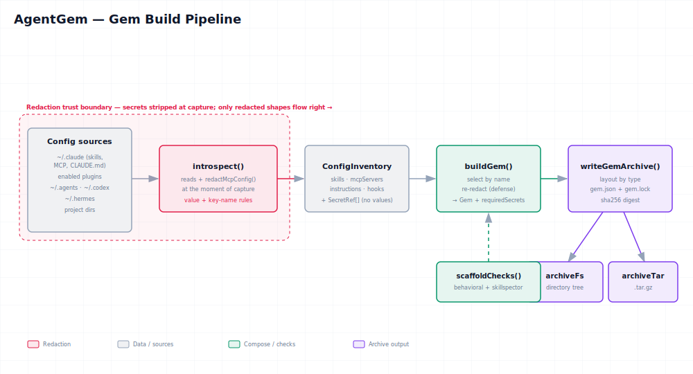

# The build pipeline

A Gem is produced by four pure functions in the `@agentgem/*` packages, chained from raw config to a
verifiable archive. This page traces that path. The safety rule that runs through it lives
in [Redaction](redaction.md); the on-disk result is specified in
[Archive format](archive-format.md).



> Diagram: [`diagrams/gem-pipeline.svg`](diagrams/gem-pipeline.svg) ·
> [PNG](diagrams/gem-pipeline.png) ·
> [interactive HTML](diagrams/gem-pipeline.html)

## 1. Introspect — read config into an inventory

`introspectConfig(opts)` reads global config; `introspectProject(root)` reads a project's
config. Sources include `~/.claude` (skills, MCP servers from `settings.json` / `.mcp.json`,
`CLAUDE.md`), enabled plugins, `~/.agents/skills`, `~/.codex`, and `~/.hermes`. The REST and
MCP layers call `introspectAll`, which merges the global inventory with any selected project
inventories.

`resolveDirs(dir?)` derives all discovery roots from a single base, so a test (or a
`?dir=` override) can point the whole introspection at a fake home and stay self-contained.

The output is a `ConfigInventory`:

```ts
interface ConfigInventory {
  skills: SkillArtifact[];
  mcpServers: McpServerArtifact[];
  instructions: InstructionsArtifact[];
  hooks: HookArtifact[];
  projects?: ProjectInventory[];
}
```

**Redaction happens here, at capture** — `introspect` calls `redactMcpConfig` while reading,
so the inventory already carries `<redacted>` in place of secret values, plus a
`secretRefs: SecretRef[]` list of what was stripped and where.

## 2. Redact — strip secrets, record references

`redactMcpConfig(config)` returns `{ config, secrets }`: the structure is preserved, secret
values become `"<redacted>"`, and each strip is recorded as a `SecretRef { name, location }`.
The rules (key-name regex + value entropy + `env`/`headers` defaults) are detailed in
[Redaction](redaction.md). This step is the reason every downstream consumer is secret-safe
by construction.

## 3. buildGem — select into a Gem

`buildGem(inventory, selection, opts?)` turns an inventory plus a selection into a `Gem`:

```ts
type GemSelection =
  | { all: true }
  | { all?: false; skills?: string[]; mcpServers?: string[];
      includeInstructions?: boolean; hooks?: string[];
      projects?: Record<string, ProjectSelection> };
```

It:

- validates every named artifact exists (throws on unknown names);
- collects the selected artifacts;
- **re-redacts** any MCP/hook artifact that arrives without `secretRefs` — defense in depth,
  so a Gem can never be built from un-redacted input;
- aggregates a `SecretRequirement[]` (`{ name, artifact, location }`) describing the secret
  surface by name only — never values;
- redacts any operator-provided checks before embedding them.

The result:

```ts
interface Gem {
  name: string;
  createdFrom: string;
  artifacts: GemArtifact[];
  checks: GemCheck[];                  // 0..n embedded checks
  requiredSecrets: SecretRequirement[]; // declared surface; names only
}
```

### Checks (optional)

`scaffoldChecks(gem)` drafts a smoke-test **behavioral** check (a task + deterministic
assertions, optional LLM judge) and, when the Gem has skills, an **external** check that runs
the `skillspector` security scanner. Checks travel inside the Gem and are themselves redacted.
See `types.ts` for `BehavioralCheck`, `ExternalCheck`, `EvalAssertion`, and `EvalJudge`.

## 4. Archive — lay out, hash, serialize

`writeGemArchive(gem, opts?)` lays artifacts out by type and writes the manifest + lock:

```
skills/<name>/SKILL.md
mcp/<name>.json            { transport, config, source?, secretRefs? }
hooks/<name>.json          { event, matcher?, config, source?, secretRefs? }
instructions/<name>.md
checks/<name>.json
gem.json                   # manifest — the human-meaningful index
gem.lock                   # lock — file hashes + gemDigest (sha256)
```

`computeLock` hashes every file (the manifest via canonical stable JSON) and derives a
deterministic `gemDigest`; `verifyLock` checks integrity on read. The file tree is then
serialized two ways:

- `writeArchiveDir` / `readArchiveDir` — a directory on disk;
- `packTar` / `unpackTar` — a deterministic gzipped tar (sorted paths, fixed mtime) for
  transport and registry storage.

Full details — field shapes, digest computation, and verification — are in
[Archive format](archive-format.md).

## From the outside

Via REST (`POST /api/gem`) or the MCP `build_gem` tool, the whole pipeline runs behind one
call: introspect the requested dirs, build from the selection, return a redacted `Gem`.
`POST /api/archive` adds the manifest + lock and (optionally) a `.tar.gz`. See the
[API reference](api-reference.md).
