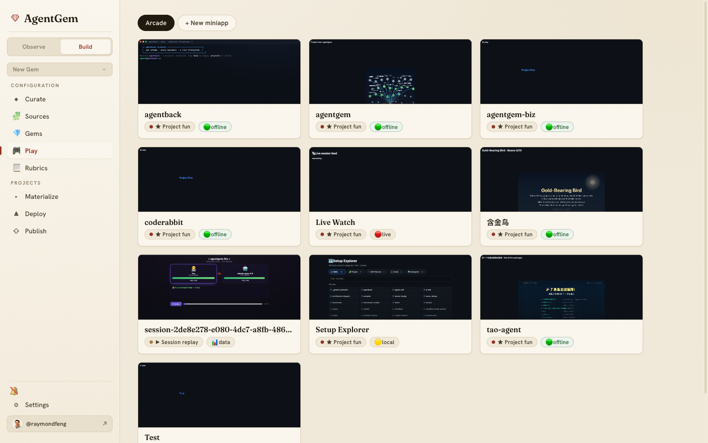
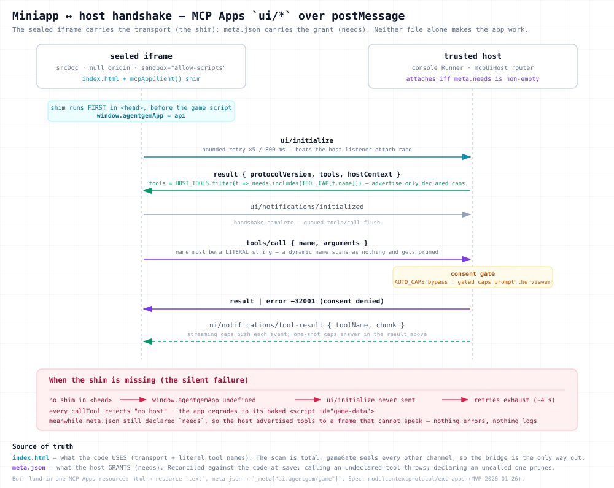

# Play: AI-generated mini-games as Gems

**Play** (**`#/play`**) turns your work into small, self-contained HTML mini-games —
built by chatting with a coding agent — and treats each one as a first-class Gem you
can version, share, and publish. A game about replaying your best session, a
skill-runner, a bit of project fun: each is a single sealed HTML file *and* an
installable `game` Gem at the same time.

Play has three views, all under the one `#/play` route:

## Arcade — browse and play

The **Arcade** is a grid of your mini-games. Each card renders a live, click-through
thumbnail of the actual game (lazily loaded), with a **🟢 offline** pill for games
that need nothing from the host and capability pills for ones that ask for live data.
Click a card to open it in Studio.

## Composer — start a new miniapp

**+ New miniapp** opens the **Composer**, where you pick what to seed the game from:

- **Project** — build something around one of your repos.
- **Session** — turn a past session into a replay.
- **Skill** — a runner for one of your skills.
- **HTML** — import an existing single-file game.
- **Blank** — start from scratch.

Composer doesn't edit the game; it creates it and hands off to Studio.

## Studio — build it by chatting

**Studio** is where the game gets made. A coding agent edits the single HTML file in
place while you describe what you want, with a **live preview** beside the chat. The
agent works within fixed `// ==== AGENTGEM:GAME-LOGIC START/END ====` markers in a
scaffold, so the sealed shell around your game stays intact. Studio hosts the three
finishing actions — **Save**, **Push to git**, and **Share** — described below.

The full authoring contract is the **`agentgem-miniapp`** skill (in
[`skills/agentgem-miniapp/`](https://github.com/ninemindai/agentgem/tree/main/skills/agentgem-miniapp)),
injected into the Studio agent's first turn so it knows the rules before it writes a
line.

## The sealed model

A mini-game runs in a **sealed iframe with a null origin** — `sandbox="allow-scripts"`
with no same-origin access, under a strict Content-Security-Policy that allows inline
script and style and `data:` assets but **no network at all**. That's what makes a
game safe to run straight from the marketplace: it can't call home, read cookies, or
reach your machine.

Because the runtime is sealed, a game is **admitted** by a save-time gate (the
"seal") that rejects anything that wouldn't work — external `src`/`href`, bare module
imports, `fetch`/`WebSocket`/`XMLHttpRequest` and friends — caps the bundle at
1.5 MB, and smoke-loads it to be sure it doesn't throw. If a save fails the seal,
Studio shows an actionable banner with a **Fix with agent** button that hands the
failure straight back to the agent to correct.

Seed data (the session, project, or skill you built from) is baked into the page as an
inert `<script id="game-data" type="application/json">` block in the `<head>`, scrubbed
for home paths and common token shapes on the way in. A game that needs *live* data
declares it and receives it from a **trusted host** over the **MCP Apps** `ui/*`
JSON-RPC protocol via an injected `window.agentgemApp` client — never over the
network. Capabilities are declared in the game's `meta.json`
`needs`: `session-data` (auto-approved), and the consent-gated `local-project-access`,
`live-session-events`, and `invoke-agent`.

> Diagram: [`diagrams/miniapp-host-handshake.svg`](diagrams/miniapp-host-handshake.svg) ·
> [PNG](diagrams/miniapp-host-handshake.png) ·
> [interactive HTML](diagrams/miniapp-host-handshake.html) (Copy / PNG / PDF export)

The two files carry different halves of the same contract, and **neither one alone makes
the app work**. `index.html` carries the *transport* — the injected client shim, which
must run before the game's own script so `window.agentgemApp` exists when it's needed.
`meta.json` carries the *grant* — the host only attaches when `needs` is non-empty, and
answers `ui/initialize` advertising exactly the declared capabilities. A bundle that
declares `needs` but carries no shim never sends `ui/initialize` at all: the handshake
retries exhaust, every `callTool` rejects with `"no host"`, and the game quietly falls
back to its baked `game-data` while the host waits for a frame that cannot speak.

## The git-backed registry

Your mini-games live in **`~/.agentgem/miniapps/`** (or `$AGENTGEM_HOME/miniapps`),
one directory per game holding its `<name>.html` and a `meta.json`. **That directory
is a git repository, and versioning *is* git** — every save, seed, import, and
in-progress checkpoint is a commit, so you have full history and can push the whole
registry to a remote. (There's no separate numeric version to manage;
`meta.engineVersion` tracks the scaffold engine, not your edits.)

## Save, push, and share

Studio's three actions are distinct:

- **Save** — runs the seal, writes the HTML + `meta.json`, git-commits, and
  (re)writes the one-artifact `game` Gem. This is what makes the game real.
- **Push to git** — `git push` of the whole miniapps registry to its remote, so your
  games are backed up and portable across machines.
- **Share** — publishes the game to the public marketplace at
  [app.agentgem.ai](https://app.agentgem.ai), tagged `game` plus its genre. A
  **capture step** first grabs a screenshot of the running game so its link-preview
  and marketplace card show the real thing (see [OG cards](sharing.md#branded-link-previews)).
  You choose a **visibility** (Public / Unlisted / Private) and, for an existing key,
  whether to **overwrite or cut a new version**. Publishing requires an account (see
  [Identity](sharing.md#identity)); if you're signed out, Studio connects you inline and
  then **resumes the publish you started** — no second click. On success it links your
  marketplace gem page.

Once published, a game lives in the marketplace **arcade** (`app.agentgem.ai/`) — an
**early testbed**, so treat it as a preview — where it's searchable by genre and tag,
counts plays, and plays offline: a sealed game carries everything it needs, so there is
no network to lose.

## On the desktop app

The embedded [desktop console](desktop.md) has the full Play experience — browse,
play, and remix mini-games — the same as `npx`.

---

*Changing the miniapp platform itself, rather than playing or authoring? The
normative spec is [`miniapps/spec.md`](miniapps/spec.md), and the design
decisions and lessons behind it are in
[`miniapps/evolution.md`](miniapps/evolution.md).*
